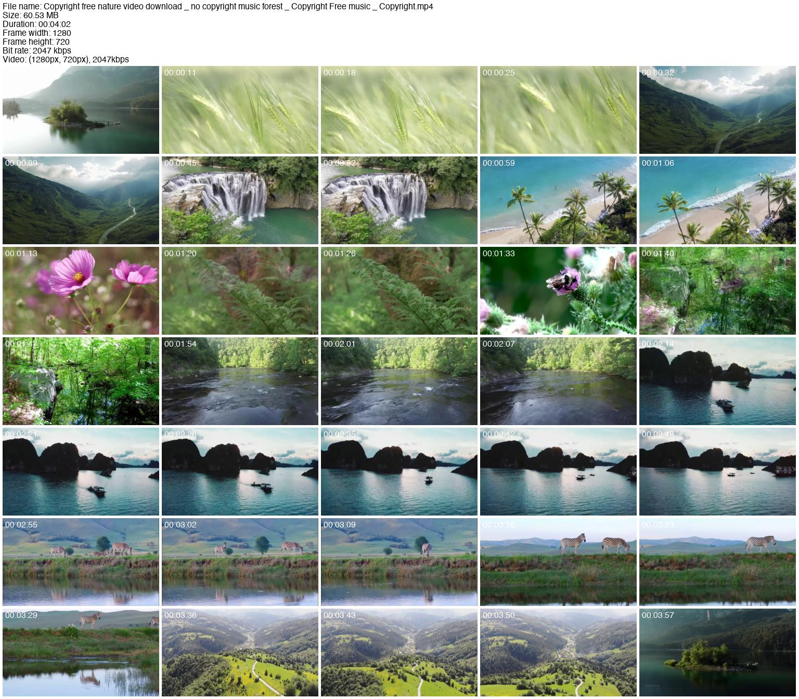

# Thumbnails



Great! Including the font file simplifies the setup process further. Here is the updated README file to reflect the inclusion of the font file:

---

# Thumbnail Generator

## Installation

Installing dependencies manually can be a challenging and tedious process. To simplify this, we have provided a batch file and a PowerShell script that will install all necessary dependencies for you.

### Prerequisites

- Windows 10 or above

### Automated Installation

1. **Download the Files:**
   - Ensure you have the following files in the same directory:
     - `thumbnail.py`: The main script for generating thumbnails.
     - `update_python_and_dependencies.ps1`: PowerShell script for installing dependencies.
     - `run_update_script.bat`: Batch file to run the PowerShell script as an administrator.
     - `HelveticaNeue.ttc`: The font file required by the script.

2. **Run the Batch File:**
   - Double-click `run_update_script.bat` to start the installation process.
   - The batch file will request administrator privileges. Please confirm the UAC prompt.
   - The PowerShell script will check for the latest Python version and install it if necessary.
   - It will then install the required Python packages: Pillow (PIL), ffmpeg, and PyAV.
   - Any errors encountered during this process will be logged in `error_log.txt` in the same directory.

3. **Check the Log:**
   - If an error occurs, check `error_log.txt` for detailed error messages.

### Manual Installation

If you prefer to install the dependencies manually, follow these steps:

1. **Install Python 3:**
   - Download and install Python 3 from the official website: [Python Downloads](https://www.python.org/downloads/)

2. **Install Python Packages:**
   - Open a command prompt and run the following commands to install the necessary packages:
     ```sh
     python -m pip install --upgrade pip
     python -m pip install Pillow
     python -m pip install ffmpeg
     python -m pip install av
     ```

## Usage

1. **Font Configuration:**
   - The truetype font file `HelveticaNeue.ttc` is included in the same directory as `thumbnail.py`.
   - Ensure that the `FONT_NAME` variable in `thumbnail.py` is set to `"HelveticaNeue.ttc"`.

2. **Run the Thumbnail Generator:**
   - Open a command prompt and navigate to the directory containing `thumbnail.py`.
   - Run the script by executing:
     ```sh
     python thumbnail.py
     ```
   - You will be prompted to enter the path of the directory containing the video files you want to process.

3. **Temporary Files:**
   - You may notice that files are renamed and some temporary files are created during the script execution. This is a workaround for a known bug in PyAV.

## Known Issues

- There is a known bug in PyAV that causes issues with metadata decoding. The script includes a workaround by renaming files and creating temporary files. If you encounter issues, please check the log file for details.

## Contributing

- If you are able to fix the PyAV bug or improve the script, contributions are welcome! Please submit a pull request or open an issue on the repository.

---

### Included Files:

- `thumbnail.py`: Script for generating thumbnails.
- `update_python_and_dependencies.ps1`: PowerShell script to install dependencies.
- `run_update_script.bat`: Batch file to run the PowerShell script as administrator.
- `HelveticaNeue.ttc`: Font file required by the script.

This updated README file should now provide clear and concise instructions for setting up and running your thumbnail generator script, with the font file included.
